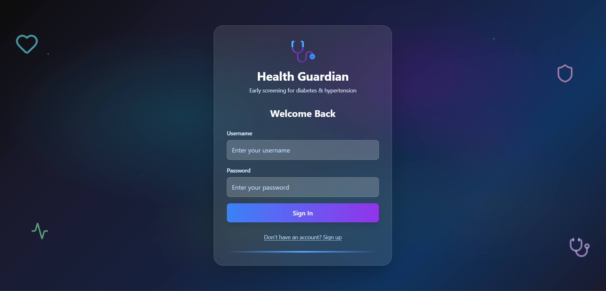
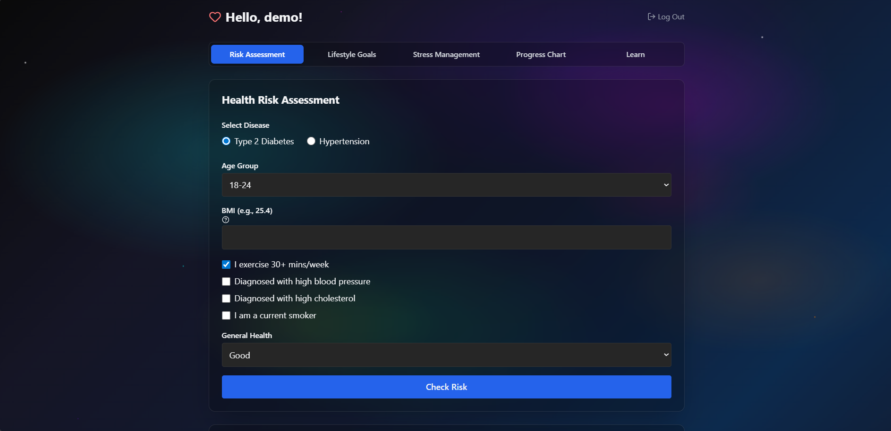
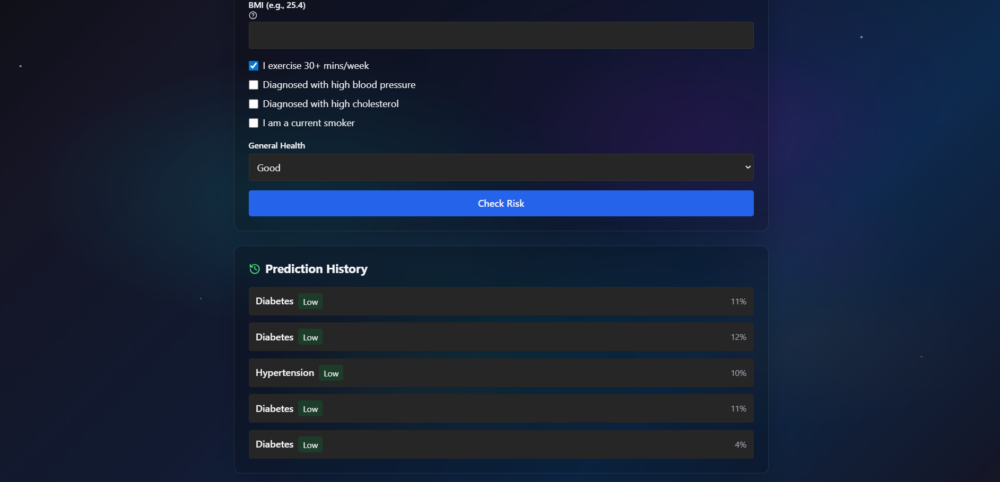
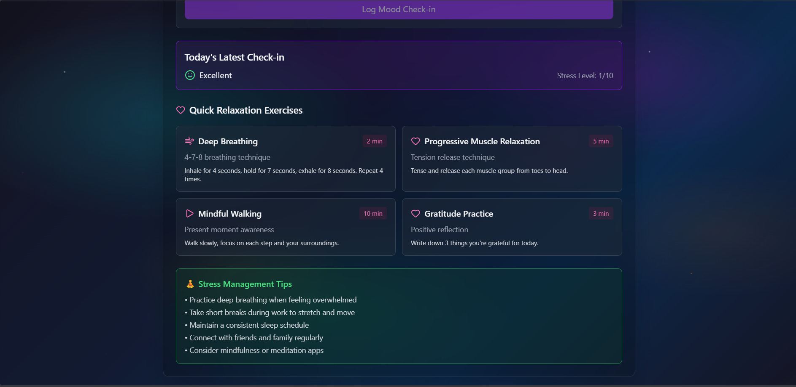
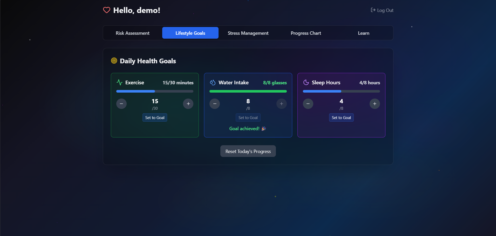
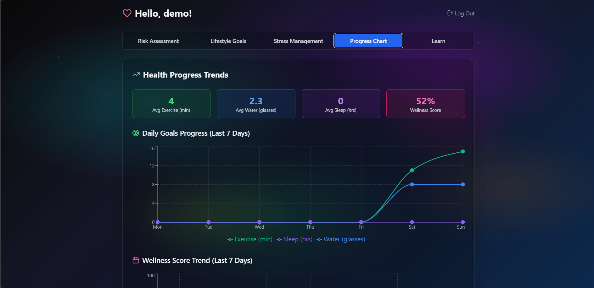
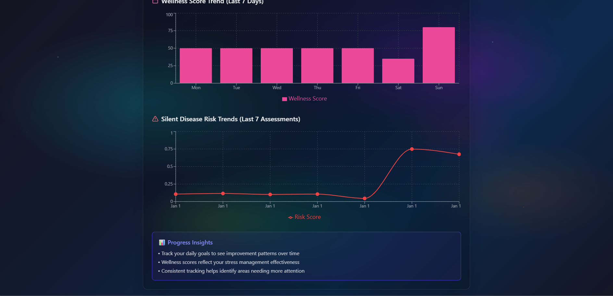
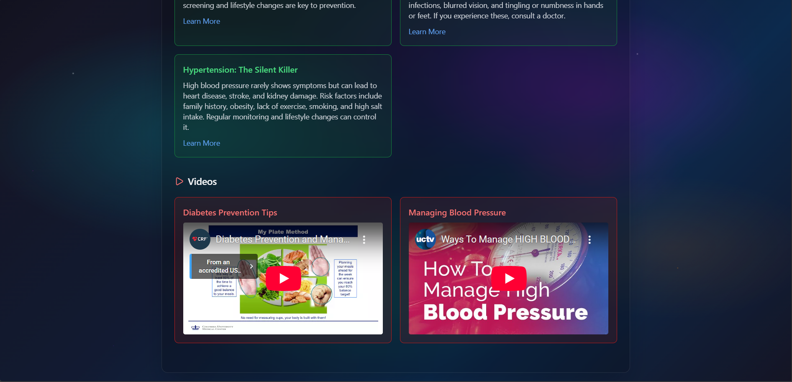

# Health Guardian
Repository for Health Guardian - A health risk assessment application
## Problem Statement - 

PS 05 - "Silent Disease" Early Detection Engine
(Detect What Patients Don’t Even Know They Have)

## Description

Silent diseases such as type 2 diabetes and hypertension often develop asymptomatically, leading to severe complications if undetected. This project aims to provide early risk assessment and personalized lifestyle recommendations to mitigate these risks through proactive health management.

## Project Name

Health Guardian

## Team Name

TECHTEAM

## Deployed Link

N/A (Local development setup required)

## 2-Minute Demonstration Video Link

[Demo Video](https://drive.google.com/drive/folders/1RPNO4eoG3Vbb-xQn4XVW8sBClEgC6Ezt?usp=sharing) 

## PPT Link

[PPT Presentation](https://drive.google.com/drive/folders/1RPNO4eoG3Vbb-xQn4XVW8sBClEgC6Ezt?usp=sharing) 
## Project Overview

Health Guardian is a web-based application designed to assess individual risks for silent diseases like diabetes and hypertension. Its features:

- Risk assessment through user input (age, BMI, lifestyle factors)
- Personalized advice and goal suggestions
- Lifestyle tracking (exercise, water intake, sleep, stress management)
- Educational content on silent diseases
- Progress visualization and history

The app uses machine learning models for risk prediction and provides an intuitive interface for users to monitor and improve their health.

## Setup & Installation Instructions

### Prerequisites

- Python 3.8+
- Node.js 16+
- Git

### Backend Setup

1. Navigate to the backend directory:

   ```bash
   cd backend
   ```

2. Create a virtual environment:

   ```bash
   python -m venv venv
   source venv/bin/activate  # On Windows: venv\Scripts\activate
   ```

3. Install dependencies:

   ```bash
   pip install -r requirements.txt
   ```

4. Run the backend server:
   ```bash
   python app.py
   ```
   The server will start on http://127.0.0.1:5000

### Frontend Setup

1. Navigate to the frontend directory:

   ```bash
   cd frontend
   ```

2. Install dependencies:

   ```bash
   npm install
   ```

3. Start the development server:
   ```bash
   npm run dev
   ```
   The app will be available at http://localhost:5173

### Database

The app uses SQLite. The database file will be created automatically in the `instance/` directory when you run the backend for the first time.

## Usage Instructions

1. **Registration/Login**: Create an account or use the demo account (username: demo, password: hackathon)

2. **Risk Assessment**: Fill out the health assessment form with your details to get a risk evaluation for diabetes or hypertension.

3. **View Results**: See your risk level, personalized advice, and suggested goal adjustments.

4. **Lifestyle Tracking**: Use the Lifestyle Goals tab to track daily exercise, water intake, and sleep.

5. **Stress Management**: Log mood and stress levels, access relaxation exercises.

6. **Progress Charts**: Monitor your health trends over time.

7. **Learn**: Access educational articles, videos, and quizzes about silent diseases.

## Relevant Screenshots

### Login Page



### Risk Assessment Form




### Stress Management




### Lifestyle Goals



### Progress Charts




### Learn Tab




